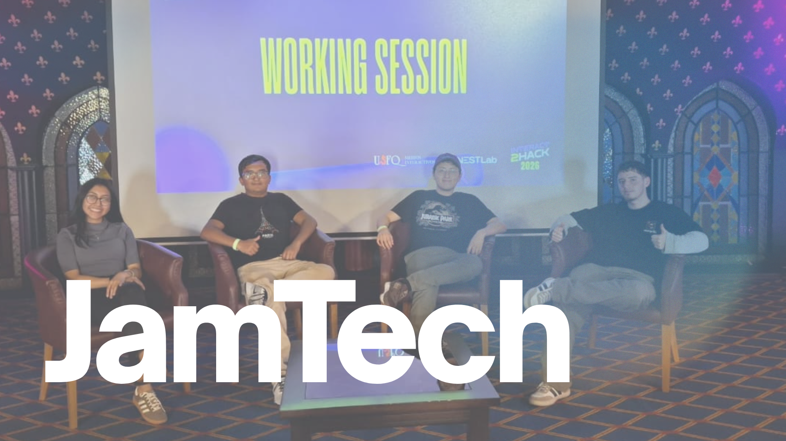
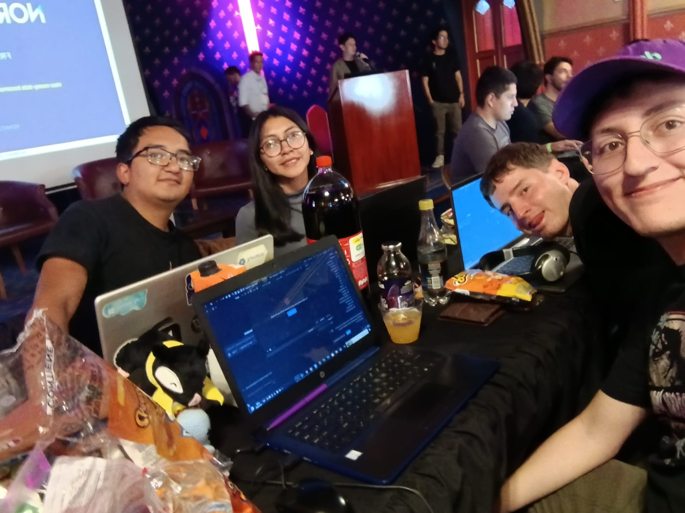
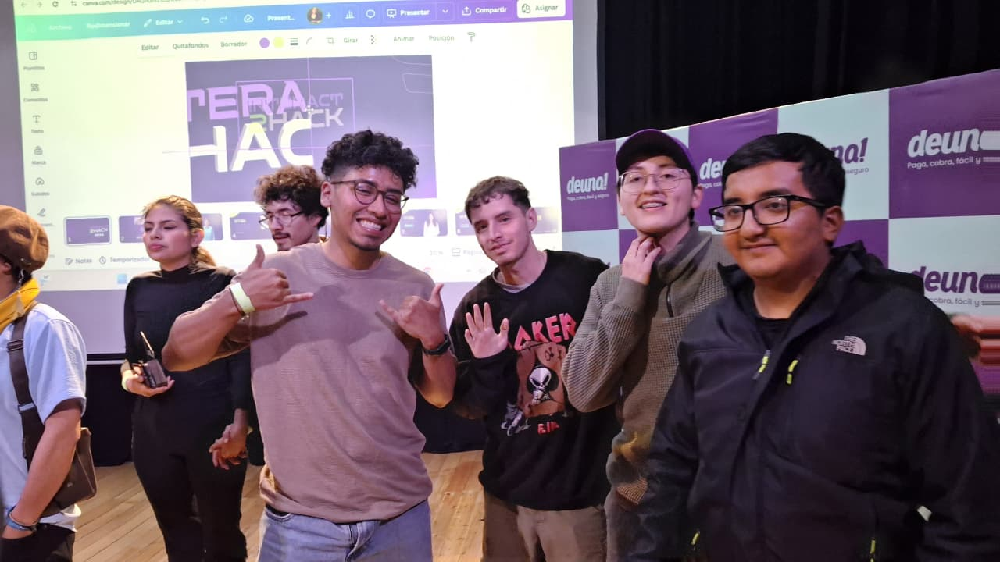
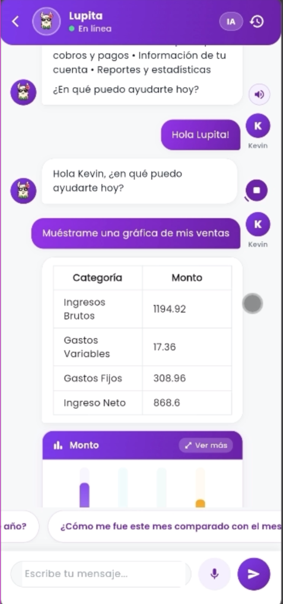
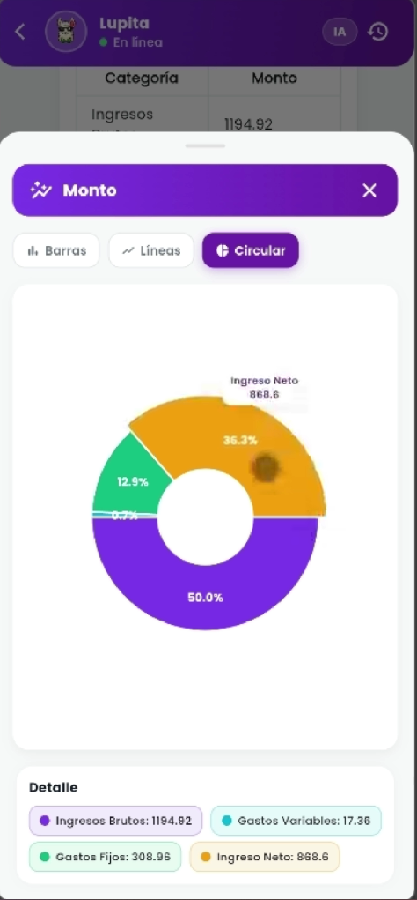
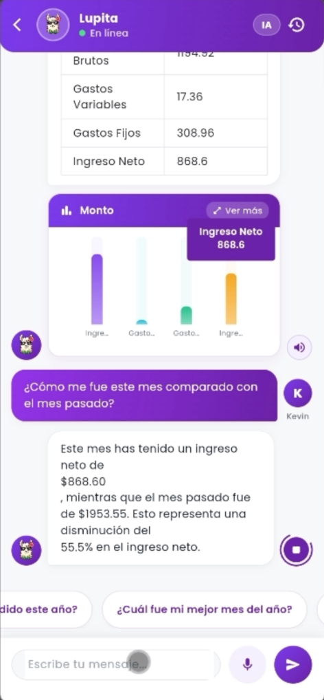
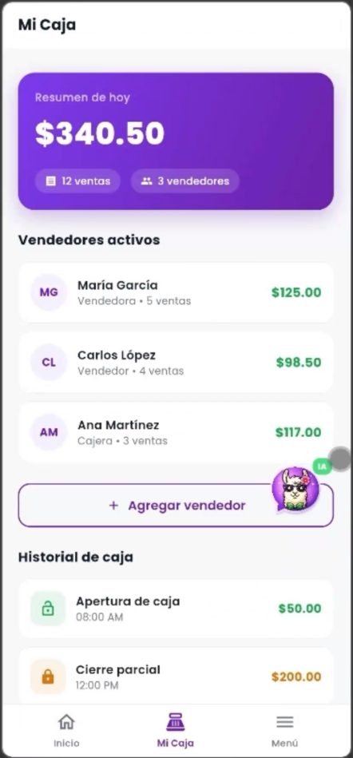

<div align="center">

# 🤖 Lupita — AI Business Assistant for Deuna

### Built by Team JAMTECH · Interact2Hack 2026 · Finalists 🏆



[](https://fastapi.tiangolo.com/)
[](https://flutter.dev/)
[](https://www.mongodb.com/)
[](https://langchain.com/)
[](https://elevenlabs.io/)

</div>

---

## 🏆 The challenge

**Interact2Hack 2026** is one of Ecuador's top university hackathons, hosted at Universidad San Francisco de Quito. Our team tackled the **Deuna Corporate Challenge — AI Track**: build a conversational business assistant for Ecuadorian micro-merchants who use Deuna as their payment platform.

The problem: small business owners had all their financial data in the Deuna app but couldn't read or act on it. Traditional dashboards were overwhelming, reports went unread, and decisions were made by gut feeling.

**Our solution: Lupita** — an AI assistant that talks to merchants in plain Spanish, answers business questions in under 5 seconds, and helps them understand if they're winning or losing money.

---

## 📸 At the event

<div align="center">




</div>

---

## 📱 Lupita in action

<div align="center">

| | | |
|---|---|---|
|  |  |  |



</div>

---

## ✨ What Lupita does

- 🧠 **Business RAG** — powered by LangChain and ChromaDB, answers questions like "how much did I sell this week?" or "which customers haven't come back?"
- 📊 **Real-time analytics** — generates charts directly in the chat: gains vs losses, monthly trends, customer metrics
- 🎙️ **Voice interaction** — talk to Lupita naturally with STT, and she responds with realistic voice via ElevenLabs TTS
- 💼 **Financial insights** — gross income, fixed/variable expenses, net profit, buyer personas, average ticket
- 🔔 **Proactive alerts** — Lupita warns merchants about relevant trends without being asked

---

## 🛠️ Tech stack

### Frontend (Flutter)
- **State Management**: Provider
- **UI Components**: Google Fonts, Material Design 3
- **Charts**: fl_chart
- **Voice**: audioplayers, record

### Backend (FastAPI)
- **Framework**: FastAPI (Python 3.10+)
- **Database**: MongoDB (Storage) & ChromaDB (Vector Store)
- **AI Orchestration**: LangChain, Groq/OpenAI
- **Voice AI**: ElevenLabs SDK

---

## 🚀 Quick start

### 1️⃣ Clone the repository
```bash
git clone https://github.com/Jdquimbiulco/lupita-deuna.git
cd lupita-deuna
```

### 2️⃣ Backend setup
```bash
cd BACKEND
pip install -r requirements.txt
# Configure your .env with MONGO_URI, ELEVENLABS_API_KEY, etc.
python main.py
```

### 3️⃣ Frontend setup
```bash
cd FRONTEND
flutter pub get
flutter run
```

---

## 📁 Project structure

```
lupita-deuna/
├── BACKEND/             # FastAPI Server, AI Services & Database Logic
│   ├── routers/         # API Endpoints (BusinessBot, Analytics)
│   ├── services/        # AI Agents & Bot Tools
│   └── database/        # MongoDB & ChromaDB connections
├── FRONTEND/            # Flutter Application
│   ├── lib/views/       # UI Screens (Home, Chat, Analytics)
│   ├── lib/config/      # Constants & Theme
│   └── assets/          # Images & Fonts
└── docs/                # Documentation & Assets
```

---

## 👥 Team JAMTECH

| Role | Name |
|------|------|
| Team Lead & Backend | [Mateo Medranda](https://github.com/MateoMedranda) |
| Voice (STT/TTS), UI & UX | [Juan Diego Quimbiulco](https://github.com/Jdquimbiulco) |
| Database & Documentation | [Alejandro Obando](https://github.com/AlejandroObando23) |
| Marketing & Pitch | Vanessa Alvear ([LinkedIn](https://www.linkedin.com/in/vanessa-alvear1111/)) |

---

## 🎯 My contributions

- 🎙️ **Voice-to-Text (STT)** — natural voice input so merchants can talk to Lupita hands-free
- 🔊 **Text-to-Speech (TTS)** — ElevenLabs integration for realistic, natural voice responses
- 📱 **Flutter UI implementation** — chat interface and overall user experience
- 💡 **Feature ideation** — contributed key ideas that shaped the product direction

---

## 🏁 Result

**Finalists at Interact2Hack 2026** — Deuna AI Track, Universidad San Francisco de Quito, Ecuador.

---

<div align="center">

Built with ❤️ by Team JAMTECH · Interact2Hack 2026

</div>
